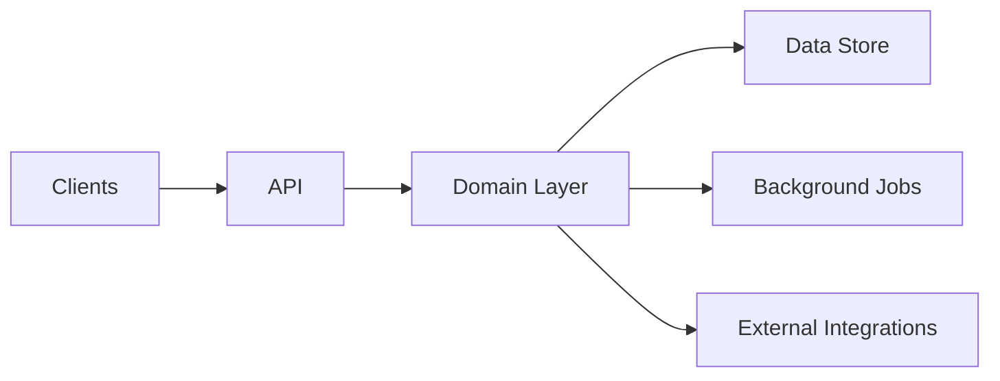

# Architecture Overview (Template)

## High-level Diagram

## Key Decisions
- <Decision 1 + rationale>
- <Decision 2 + rationale>

## Data / State
- <What is the source of truth?>
- <How do we model state transitions?>

## Failure Modes
- <Expected failures and recovery strategy>

